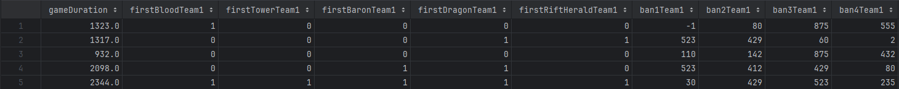
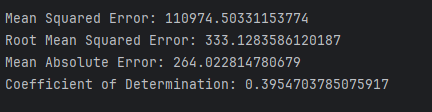
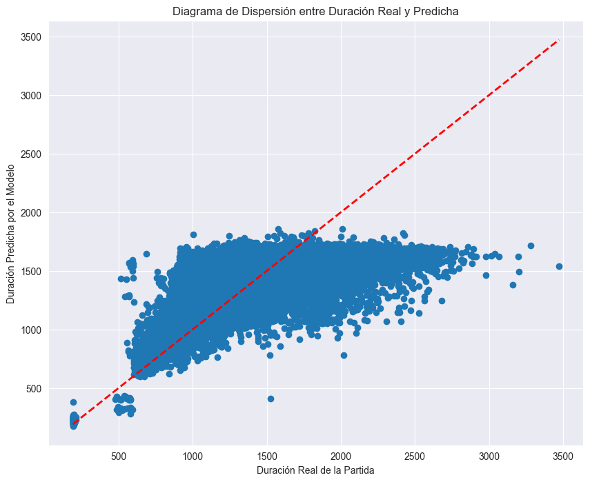

# Modelo de Prediccion de Partidas de League of Legends

---

***Luciano Masuelli***

***Facundo Gaviola***

***Facultad de Ingeniería, Universidad Nacional de Cuyo***


---
## Introducción


El propósito de este proyecto es anticipar el resultado de una partida en League of Legends, determinando tanto si un equipo 
en particular alcanzará la victoria, como la duración del encuentro. Para lograrlo, se emplearon algoritmos de Inteligencia Artificial, utilizando datos 
relacionados con ambos equipos que participan en el enfrentamiento, así como características clave que definen el inicio 
de la partida.

Para dar un poco de contexto, League of Legends (LoL) es un popular videojuego de 
estrategia en tiempo real que ha alcanzado una inmensa popularidad desde su lanzamiento en 2009. En este juego, dos 
equipos de cinco jugadores se enfrentan en un campo de batalla virtual, cada uno controlando un campeón con habilidades 
únicas. El juego ha dejado una marca indeleble en el mundo de los esports, destacándose por su enorme base de jugadores,
la celebración del Campeonato Mundial anual con premios millonarios, y el establecimiento de ligas profesionales en
diversas regiones.  
A continuación, se presentan algunos conceptos clave relacionados con League of Legends:

- **Campeones**: En LoL, los jugadores toman el control de personajes únicos llamados "campeones". Cada campeón tiene habilidades y 
roles distintivos en el campo de batalla. La elección estratégica de campeones es esencial para la victoria, ya que cada 
uno contribuye de manera diferente al equipo.  

- **Invocadores**: Los jugadores son conocidos como "invocadores". Controlan a los campeones y toman decisiones tácticas durante la partida. 
El término "invocador" refleja el hecho de que los jugadores "invocan" a sus campeones para luchar en su nombre.  

- **Mapa**: La acción principal en LoL tiene lugar en un mapa específico llamado "Grieta del Invocador". Este mapa está dividido en 
tres carriles (superior, central e inferior) y cuenta con selvas, torres y bases. El objetivo es destruir el nexo enemigo 
ubicado en la base.  

- **Oro**: Los jugadores ganan oro al derrotar a los enemigos y destruir torres. El oro se puede utilizar para comprar objetos que 
mejoran el rendimiento de los campeones.

- **Experiencia**: Los jugadores ganan experiencia al derrotar a los enemigos y destruir torres. La experiencia se utiliza para 
mejorar las habilidades de los campeones.

- **Dragones y Heraldo**: Los dragones y el Heraldo son criaturas poderosas que aparecen en la selva del mapa. Derrotar a alguno de estos
otorga beneficios al equipo. Baron Nashor es una bestia aún más formidable que proporciona recompensas significativas y 
puede cambiar el curso de la partida, pero no aparece hasta el minuto 20.  

- **Objetivos y Torres**: Además de eliminar al equipo contrario, los jugadores deben destruir torres enemigas y objetivos como inhibidores para 
abrir el camino hacia el nexo enemigo. La destrucción de estos elementos proporciona ventajas estratégicas.  

- **Roles**: Los jugadores asumen roles específicos en el equipo, como asesino, tirador, tanque o soporte. 
La combinación equilibrada de roles es esencial para abordar diferentes situaciones de juego.

- **Meta del Juego**: El objetivo final es destruir el nexo enemigo, pero el camino hacia la victoria implica tomar decisiones estratégicas, 
coordinarse con el equipo y adaptarse a las tácticas enemigas.

Por todo lo mencionado anteriormente, se puede considerar de una gran importancia el poder predecir el resultado de una
partida de LoL, ya que esto puede ser utilizado, ya sea para apuestas deportivas, mejorar el rendimiento de un equipo o
simplemente comprender las distintas variables que se relacionan entre sí durante una partida a la hora de conseguir la
victoria.

Se implementaron modelos de inteligencia artificial, como Random Forest o alguna variante de boosting, con el objetivo 
de prever los resultados de las partidas en League of Legends.   
La elección de estas técnicas de inteligencia artificial se sustenta en varios factores cruciales:
* Complejidad del juego: League of Legends presenta una complejidad considerable, con numerosas variables que pueden 
ejercer una influencia significativa en el desarrollo y desenlace de cada partida.
* Gran cantidad de datos: Debido a la popularidad de LoL, es una tarea facil la recopilación de una gran cantidad de 
partidas para poder entrenar los modelos.
* Analisis de variables: Mediante la aplicacion de tecnicas de inteligencia artificial, se puede analizar cuales son las
variables que mas influyen en el resultado de una partida, y cuales son las que menos influyen. Algortimos como Random
Forest permiten analizar la importancia de cada variable a la hora de realizar una prediccion.

Para la realizacion del proyecto se utilizaran partidas de la region de Corea de la temporada 2020 de LoL. Estas 
partidas fueron obtenidas de la pagina web de Kaggle, y se pueden encontrar en el siguiente link:
https://www.kaggle.com/datasets/gyejr95/league-of-legendslol-ranked-games-2020-ver1/data?select=match_winner_data_version1.csv

Se intentarán utilizar como variables predictoras a aquellos datos que puedan ser obtenidos al comienzo de una partida 
o en su defecto, en los primeros minutos de transcurrida la misma. Esto se debe a que se busca realizar una predicción
lo más temprana posible en la partida.

---

## Marco teórico

**Árboles de Decision**

Los árboles de decision representan una función que toma como entrada un vector de atributos y valores y devuelve como 
resultado una decision. Cada nodo interno del arbol representa una prueba sobre un atributo, cada rama representa el
resultado de una prueba y cada nodo hoja representa una clase. El camino desde la raíz hasta una hoja representa una
regla de clasificación.

El algoritmo en pseudocodigo utilizado para la creacion de un arbol de decision es el siguiente:
* plurality-value devuelve el valor mas comun entre los ejemplos.
* A es el atributo que mejor clasifica los ejemplos.
* IMPORTANCE es una funcion que mide la importancia de un atributo.
* v_k es el valor de A que corresponde a la rama del arbol.
* e.A es el valor del atributo A en el ejemplo e.
```
function decision-tree-learning(examples, attributes, parent_examples) returns a tree
    if examples is empty then return plurality-value(parent_examples)
    else if all examples have the same classification then return the classification
    else if attributes is empty then return plurality-value(examples)
    else
        A <- argmax a in attributes IMPORTANCE(a, examples)
        tree <- a new decision tree with root test A
        for each value v_k of A do
            exs <- {e : e in examples and e.A = v_k}
            subtree <- decision-tree-learning(exs, attributes - A, examples)
            add a branch to tree with label (A = v_k) and subtree subtree
        return tree
```

**Random Forest**

Random Forest es un algoritmo de aprendizaje basado en arboles de decision. El algoritmo crea una serie de arboles de
decision, de la misma manera que lo hace un algoritmo de bagging, pero en este caso, en el momento de en que cada arbol
del modelo va a crear nuevas ramas, se selecciona un subconjunto aleatorio de `m` variables predictoras del total de 
variables predictoras `p`. En cada creacion de ramas se seleccionan `m` variables predictoras distintas. Esto se hace para
evitar que los arboles esten altamente correlacionados entre si y asi tener un modelo mas confiable. Generalmente se
utiliza `m = sqrt(p)` para la cantidad de variables seleccionadas.

**Boosting**

Boosting es un algoritmo de aprendizaje que, al igual que Random Forest, se basa en arboles de decision para realizar 
regresiones o clasificaciones. En boosting no se involucran tecnicas de boostraping, sino que se utilizan distintas
versiones modificadas de los datos de entrenamiento. El algoritmo combina multiples arboles de decision, ˆf 1,..., ˆf B
para crear un modelo de prediccion f(x) = sum(b=1 to B) f_b(x). Es importante destacar que los arboles de decision son
pequeños, es decir, tienen pocos niveles y pocos nodos. Esto mejora lentamente el rendimiento de f(x). El pseudocodigo
del algoritmo es el siguiente:
* ri es el residuo de la prediccion en el ejemplo i.
* lambda es un parametro de contraccion.
* d es la cantidad de divisiones que se realizan en cada arbol
* fb es el arbol de decision b
* f es el modelo de prediccion

```
1. Initialize f_0(x) = 0
2. For b = 1 to B:
    (a) Fit a tree ˆf b with d splits (d + 1 terminal nodes) to the training data (X, r).
    (b) Update ˆf by adding in a shrunken version of the new tree: ˆf(x) ← ˆf(x) + λ ˆfb(x).
    (c) Update the residuals,ri ← ri − λ ˆfb(xi).
3. Output the boosted model, f(x) = sum(b=1 to B) λf_b(x).
```

---


## Diseño Experimental
 
### Estructura del dataset
El dataset utilizado para la realización del proyecto fue obtenido de la plataforma Kaggle, este se encuentra en 
formato `pickle` y contiene datos de partidas de League of Legends en las categorías de maestro, gran maestro y 
retador de la región de Corea durante temporada 2020.  
En las figuras [1] y [2] se observan las columnas del dataset.  

  
Figura[1]: Columnas del dataset.

  
Figura[2]: Columnas del dataset.


Dentro de la columna `participants` se encuentran los datos de los jugadores de cada equipo, el siguiente es un ejemplo 
de los datos para un jugador en particular.  
``{'participantId': 1,
 'teamId': 100,
 'championId': 7,
 'stats': {'participantId': 1,
  'wardsPlaced': 6,
  'wardsKilled': 1,
  'firstBloodKill': True,
  'firstBloodAssist': False,
  'firstTowerKill': False,
  'firstTowerAssist': False,
  'firstInhibitorKill': False,
  'firstInhibitorAssist': False},
 'role': 'DUO_CARRY',
 'lane': 'MIDDLE'}``  

La columna `teams` contiene los datos de los equipos (dos por partida), el siguiente es un ejemplo de los datos para 
un equipo en particular.  
``{'teamId': 100,
 'win': 'Win',
 'firstBlood': True,
 'firstTower': False,
 'firstInhibitor': False,
 'firstBaron': False,
 'firstDragon': False,
 'firstRiftHerald': False,
 'towerKills': 1,
 'inhibitorKills': 0,
 'baronKills': 0,
 'dragonKills': 0,
 'vilemawKills': 0,
 'riftHeraldKills': 0,
 'dominionVictoryScore': 0,
 'bans': [{'championId': 238, 'pickTurn': 1},
  {'championId': 350, 'pickTurn': 2},
  {'championId': 523, 'pickTurn': 3},
  {'championId': 875, 'pickTurn': 4},
  {'championId': 523, 'pickTurn': 5}]}  ``


### Preprocesamiento de datos
El primer paso para la realización del proyecto es la adecuación del dataset para poder ser utilizado correctamente por
los algoritmos de inteligencia artificial. Para esto se realizó una limpieza de los datos, eliminando aquellos que no 
sean necesarios para las predicciones de los modelos, tales como, datos de temporada, creación de partida, modo de juego
(solo nos enfocamos en el modo de juego classic) y estadísticas de los jugadores al finalizar la partida.  
Como la idea del proyecto es predecir el resultado de una partida teniendo en cuenta únicamente datos del inicio de la 
partida, es decir, los primeros 10 minutos, se hizo un filtrado de los datos que no se encuentren dentro de este rango.  

También se modificó la presentación de los datos, ya que estos se encontraban almacenados en estructuras de datos, tales
como listas o diccionarios, dificultando su uso. Para ello se crearon nuevas columnas en el dataset, donde se guardaran
los datos de dichas estructuras.

Finalmente, se transformaron los datos categóricos en datos numéricos, como por ejemplo, transformar los valores True y 
False en 1 y 0 respectivamente, o transformar los nombres de los campeones en numeros enteros. Esto se realizo con el 
fin de que los algoritmos puedan trabajar de forma correcta con los datos.  

En las figuras [3], [4], [5] y [6] se puede observar el dataset luego de la limpieza y transformación de datos.
  
Figura[3]: Columnas del dataset pre procesado.  
  
Figura[4]: Columnas del dataset pre procesado.
  
Figura[5]: Columnas del dataset pre procesado.  
  
Figura[6]: Columnas del dataset pre procesado.  

**Descripción de las variables**
 - **gameDuration**: Duración de la partida en segundos.
 - **firstBlood**: Indica si el equipo obtuvo la primera muerte de la partida.
 - **firstTower**: Indica si el equipo destruyó la primera torre de la partida.
 - **firstDragon**: Indica si el equipo obtuvo el primer dragón de la partida.
 - **firstRiftHerald**: Indica si el equipo obtuvo el primer Heraldo de la Grieta de la partida.
 - **firstBaron**: Indica si el equipo obtuvo el primer Barón de la partida.
 - **ban**: Campeones bloqueados por el equipo (5 por equipo).
 - **champ**: Campeones seleccionados por el equipo (5 por equipo).
 - **creepsPerMin0-10**: Cantidad de súbditos asesinados por minuto en los primeros 10 minutos de la partida.
 - **goldPerMin0-10**: Cantidad de oro obtenido por minuto en los primeros 10 minutos de la partida.
 - **xpPerMin0-10**: Cantidad de experiencia obtenida por minuto en los primeros 10 minutos de la partida.
 - **damageTakenPerMin0-10**: Cantidad de daño recibido por minuto en los primeros 10 minutos de la partida.


La principal metrica que se utilizará para la evaluación del modelo será la cantidad de partidas predichas correctamente
sobre la cantidad total de partidas. Sobre esta metrica se calculará la precision, sensibilidad, exactitud y F-score.

### Random Forest para predicción de partidas

Para la aplicación de este modelo se utilizó la libreria de `scikit-learn`. Tambien se hizo uso de las librerias `pandas`
y `numpy` para la manipulacion de datos y `matplotlib` y `seaborn` para realizar ciertos graficos de los datos y 
resultados.

Antes de realizar el modelo de prediccion, se analizo el balanceo de clases del dataset. Se observó que dentro del mismo
habia una cantidad similar de partidas ganadas como de partidas perdidadas, por lo que no fue necesario el uso de 
tecnicas como oversampling, undersampling o SMOTE para balancear las clases. En la figura [7] se muestra como se distribuyen
las clases dentro del conjunto de entrenamiento y el conjunto de prueba.

  
Figura[7]: Balance de clases del dataset.  


Al utilizar el algoritmo Random Forest se notó que la precision del modelo se encontraba entre un 70% y 75%
dependiendo del valor de 'Random_state' utilizado, tanto cuando se evaluaban utilizando el conjunto de prueba como el 
conjunto de entrenamiento. Se vio que, en general, al modificar los parametros de random forest tales como la cantidad 
de arboles, la cantidad de ejemplos minima para la creacion de una nueva rama, o los criterios de ramificacion, no se 
obtienen mejoras significativas en las metricas del modelo.

Al igual que la metrica de precision, tanto la sensibilidad, exactitud y F-score se encontraban entre un 70% y 75%

Las figuras [8], [9], [10] y [11] muestran las matrices de confusion y métricas del modelo con un random_state = 42.

**Conjunto de Prueba**

  
Figura[8]: Matriz de confusion del modelo con datos de prueba.


Figura[9]: Metricas del modelo con datos de prueba.

**Conjunto de Entrenamiento**

  
Figura[10]: Matriz de confusion del modelo con datos de entrenamiento.

  
Figura[11]: Metricas del modelo con datos de entrenamiento.


También se realizó un análisis de la importancia de las distintas variables predictoras a la hora de realizar el modelo
de predicción con random forest.  
En la figura [12] se puede observar que la variable más influyente es 'firstTower', esto tiene sentido ya que el hecho de 
que un equipo destruya la primera torre de la partida puede ser un indicador de que dicho equipo tiene una ventaja que 
si se mantiene a lo largo de la partida, puede llevar a la victoria.  
Por otro lado, las variables 'ban1', 'ban2', 'champ1', 'champ2', etc. no realizan un aporte significativo al modelo.  


  
Figura[12]: Importancia de las variables predictoras.

### Gradient Boosting para predicción de partidas

Se aplicó también el algoritmo de Gradient Boosting para la realización del modelo de predicción. Este es una variante 
del algoritmo de Boosting en el que se van creando secuencialmente distintos modelos simples de árboles de decision, donde 
en cada iteración se intenta corregir los errores del modelo anterior. De esta forma, se va creando un modelo de 
predicción más robusto y preciso. Para la creación del modelo se hizo uso de la libreria `xgboost`. Al igual que en el 
caso de Random Forest, se utilizó la libreria `pandas` para la manipulación de datos. 

A la hora de realizar el modelo predictivo de clasificacion, se encontro con que el la precision del mismo se encontraba
entre alrededor del 73% cuando se evaluaba sobre el conjunto de prueba y un 83% cuando se evaluaba sobre el conjunto de
entrenamiento. A diferencia de random forest, no se observa una variacion dependiendo del valor de random_state. sin 
embargo, al igual que en random forest, a la hora de modificar los parametros del modelo, no se observan mejoras en el 
conjunto de prueba, pero si en el conjunto de entrenamiento en donde se llego a un 88%, lo que indica que lo unico que
logramos modificando dichos parametros es un sobreajuste del modelo.

Las metricas de sensibilidad, exactitud y F-score se encontraban entre un 75% en el conjunto de prueba y un 85% en el
conjunto de entrenamiento.

Las figuras [13] y [14] muestran las matrices de confusion y métricas del modelo

**Conjunto de Prueba**

  
Figura[13]: Matriz de confusion del modelo con datos de prueba.

**Conjunto de Entrenamiento**

  
Figura[14]: Matriz de confusion del modelo con datos de entrenamiento.

Al analizar las variables mas importantes con el modelo de boosting nos encontramos con un escenario similar al modelo
de random forest en donde la variable mas importante es 'firstTower' y las variables 'ban' y 'champ' no realizan un 
gran aporte. Esto se puede observar en la figura [15].

  
Figura[15]: Importancia de las variables predictoras.

### Random Forest para predicción de tiempo de partida

Para la aplicación de este modelo se utilizó la libreria de `scikit-learn` aunque en este caso se hizo uso de árboles de
regresión en lugar de árboles de clasificación. También se hizo uso de las librerías `pandas`.

Para este modelo se utilizaron como métricas el error cuadrático medio, la raíz del error cuadrático medio, la media del
error absoluto y el coeficiente de determinación. Dando como resultado los valores observados en las figuras [16] y [17].

**Conjunto de Prueba**

  
Figura[16]: Metricas del modelo con datos de prueba.

**Conjunto de Entrenamiento**

  
Figura[17]: Métricas del modelo con datos de entrenamiento.


Al igual que en los modelos de clasificación, se analizó la importancia de las variables predictoras (figura [18]) . 
En este caso, se puede observar un resultado inverso en algunas variables como 'firstTower' y 'firstBlood' que en los modelos de
clasificación realizaban el mayor aporte al modelo, mientras que en este caso son las variables que menos aportan. Esto tiene 
sentido, ya que la destrucción de la primera torre o la primera muerte no tienen una correlación directa con la duración de la partida.
Las variables que más aportan son las que analizan la cantidad de oro, experiencia o daño en los 
primeros 10 minutos de la partida. Esto se debe a que dichos valores aportan información sobre el desempeño de los 
jugadores durante la partida, lo que puede ser un indicador del estado de la partida, es decir, si un equipo tiene una 
ventaja considerable sobre el otro o no, aportando así información sobre la duración de la partida.  


  
Figura[18]: Importancia de las variables predictoras.

A continuación se observan distintos gráficos que dan una visión más clara de los resultados obtenidos y del funcionamiento 
del modelo.

**Diagrama de dispersión**

  
Figura[19]: Diagrama de dispersión de los resultados obtenidos por el modelo.

**Histograma de duración predicha de partidas**

  
Figura[20]: Histograma de la duración de las partidas predichas por el modelo.

**Curva de aprendizaje**

  
Figura[21]: Curva de aprendizaje del modelo.  

En la figura [21] se puede apreciar que el modelo se encuentra sobre ajustado a los datos de entrenamiento, ya que el 
error cuadrático medio se mantiene constante tanto para el conjunto de entrenamiento como para el conjunto de prueba y 
ambos errores son muy distintos entre sí.


### Gradient Boosting para predicción de tiempo de partida

Para la aplicación de este modelo se utilizó la libreria `sklearn` para la creación del modelo de boosting basado en 
histogramas. También se hizo uso de las librerías `pandas` para la manipulación de datos.

En este modelo también se utilizaron como métricas de evaluación el error cuadrático medio, la raíz del error 
cuadrático medio, la media del error absoluto y el coeficiente de determinación. 
Las figuras [22] y [23] muestran las métricas obtenidas para el modelo de boosting.

**Conjunto de Prueba**


Figura[22]: Métricas del modelo con datos de prueba.

**Conjunto de Entrenamiento**

  
Figura[23]: Métricas del modelo con datos de entrenamiento.

A continuación se observan distintos gráficos que dan una visión más clara de los resultados obtenidos y del funcionamiento 
del modelo.

**Diagrama de dispersión**

  
Figura[24]: Diagrama de dispersión de los resultados obtenidos por el modelo.


Se puede ver en la figura [24] que el modelo presenta un rango de error mayor en las partidas que duran al rededor de 1000 segundos. 
También se observa que el modelo tiene un techo alrededor de los 1800 segundos (30 minutos). Esto puede deberse a que partidas 
de más de 30 minutos son menos frecuentes y, por lo tanto, el modelo no está tan entrenado para predecir estos casos.  


**Curva de aprendizaje**

  
Figura[25]: Curva de aprendizaje del modelo.

En la figura [25] se ve que cuando el conjunto de entrenamiento es de un tamaño mayor a 20000 muestras, el error cuadrático medio 
se mantiene constante. Esto puede deberse a que el modelo ya está entrenado con una cantidad suficiente de datos y no 
necesita más para mejorar su precisión.

Finalmente, en la figura [26] se visualiza la distribución de la duración real de las partidas en el dataset.

  
Figura[26]: Distribución de la duración de las partidas con linea punteada indicando la duración media de las partidas.

---

## Análisis y discusión de resultados

A la hora de predecir el resultado de las partidas se observa que los modelos de clasificacion utilizados obtienen resultados similares,
tanto en las metricas como en las valoraciones de las variables predictoras. Algunas de las razones a las que se les 
pueden atribuir estos resultados son las siguientes:
* La variable 'firstTower' es la más influyente en la prediccion del resultado, esto puede deberse a que la destrucción de la primera
torre no necesariamente se da en una etapa temprana de la partida en contraste con las otras variables analizadas por el modelo. Un caso similar 
ocurre con la variable 'firstBlood'.
* Las variables 'ban' y 'champ' muestran, de manera sorprendente, un aporte insignificante al modelo. 
Diversas hipótesis podrían explicar este resultado. Por ejemplo, al evaluar datos de partidas competitivas en la región de Corea, 
conocida por ser la más competitiva en el juego League of Legends, los jugadores tienden a seleccionar campeones 
ya consolidados en la actualidad del juego. Además, es posible que los jugadores posean una gran habilidad 
y conocimiento de los campeones, lo que resulta en un contrarresto efectivo durante la fase de selección y ban, llevando 
a una influencia limitada en el resultado final del juego.
* La variable 'goldPerMin0-10' se ve que tanto en boosting como en random forest realiza un aporte mayor que por ejemplo
'firstBlood' o 'firstDragon'. Esto nos indica que la cantidad de oro obtenida, puede ser un factor determinante a la 
hora de definir una partida. Dicho resultado se ve potenciado debido a la habilidad de los jugadores de la redion de 
corea en donde, al ser partidas tan reñidas, la resolucion de la misma puede darse en pequeños detalles como estos.

A la hora de predecir el tiempo de partida, se observa que la dstribucion de las partidas tiende a una distribucion
normal, con una media de 1471 segundos (24,5 minutos) aunque existen ciertos casos donde no se acoplan a la distribucion
normal. Estas partidas generalmente tienden a durar menos de 1000 segundos (16,6 minutos) o incluso menos de 500 
segundos (8.3 minutos). Dichos casos atipicos puede deberse a un desbalance en la habilidad de los participantes, provocando la pronta
finalizacion de la partida. Otra posible razon puede ser el abandono de alguno de los participantes, lo que explicaria 
aquellas partidas que duran menos de 500 segundos.

En el caso del modelo de Random Forest para la prediccion de tiempo de partida, se observa una gran diferencia en las métricas 
obtenidas para el conjunto de entrenamiento y el conjunto de prueba. Esto se debe a que el modelo se encuentra sobreajustado 
a los datos de entrenamiento, por lo que no es capaz de generalizar correctamente.  
Por el contrario, el modelo de Gradient Boosting para la prediccion de tiempo de partida, obtiene resultados similares en 
ambos conjuntos de datos, lo que indica que el modelo es capaz de generalizar correctamente.

Al analizar las variables predictoras, se observa que las variables de gran importancia en los modelos de clasificacion
realizan un aporte mucho menor en los modelos de regresion. Una posible respuesta a esto se debe a que dichas variables,
como el caso de 'firstTower', 'firstBlood' o 'firstDragon', ocurren practicamente en cada partida y generalmente en los
primeros minutos de la misma, provocando que no representen un gran factor a la hora de determinar la duracion de la 
misma. Por el otro lado, las variables que que analizan la cantidad de oro, experiencia o daño en un determinado lapso
de tiempo si ofrecen un aporte significativo ya que estos valores pueden denotar cuando una partida finzaliza 
prematuramente.

---

## Conclusiones finales

En base a los resultados obtenidos de los distintos modelos implementados y las distintas metricas utilizadas, se obtuvo
unos buenos resultados a la hora de predecir el resultado de una partida de League of Legends. Sin embargo, dichos 
resultados pueden estar sobreajustados al estilo de juego de la region de corea en las altas ligas, por lo que dichos 
resultados pueden no ser extrapolables a otras regiones o ligas. Ademas, los datos utilizados en el proyecto se
encuentras desactualizados, debido a la dificultad de obtener datos recientes, por lo que los resultados pueden no ser 
los mismos en la actualidad. 

Tambien es importante tener en cuenta que dentro de los datos, no se encuentran las estadisticas de los jugadores por lo
que el modelo no es capaz de diferenciar entre un buen o mal jugador, afectando la prediccion del mismo. Ademas de que 
los modelos son incapaces de tener en cuenta factores humanos como el estado de animo, la concentracion, las 
distraccines o incluso los perifericos utlizados por los jugadores.

Una posible mejora a los modelos implementados seria la incorporación de datos específicos sobre diferentes jugadores 
para poder diferenciar entre un buen o mal jugador o el desempeño de cada jugador con un campeón en particular. De esta 
manera se podría obtener un modelo más preciso y robusto.

---

## Bibliografía

[1] Stuart Russell and Peter Norvig. Artificial Intelligence: A Modern Approach (3rd. ed.). Pearson, 2010.

[2] Gareth James, Daniela Witten, Trevor Hastie and Robert Tibshirani.An Introduction to Statistical Learning with 
Applications in R. 

[3] scikit-learn developers (2023). sklearn.ensamble.RandomForestClassifier. Disponible en: 
https://scikit-learn.org/stable/modules/generated/sklearn.ensemble.RandomForestClassifier.html#sklearn.ensemble.RandomForestClassifier

[4] scikit-learn developers (2023). sklearn.ensamble.GradientBoostingClassifier. Disponible en: 
https://scikit-learn.org/stable/modules/generated/sklearn.ensemble.GradientBoostingClassifier.html#sklearn.ensemble.GradientBoostingClassifier

[6] sckit-learn developers (2023). sklearn.ensamble.HistGradientBoostingRegressor. Disponible en: 
https://scikit-learn.org/stable/modules/generated/sklearn.ensemble.HistGradientBoostingRegressor.html#sklearn.ensemble.HistGradientBoostingRegressor

[7] xgboost developers (2022). xgboost. Disponible en: https://xgboost.readthedocs.io/en/latest/
